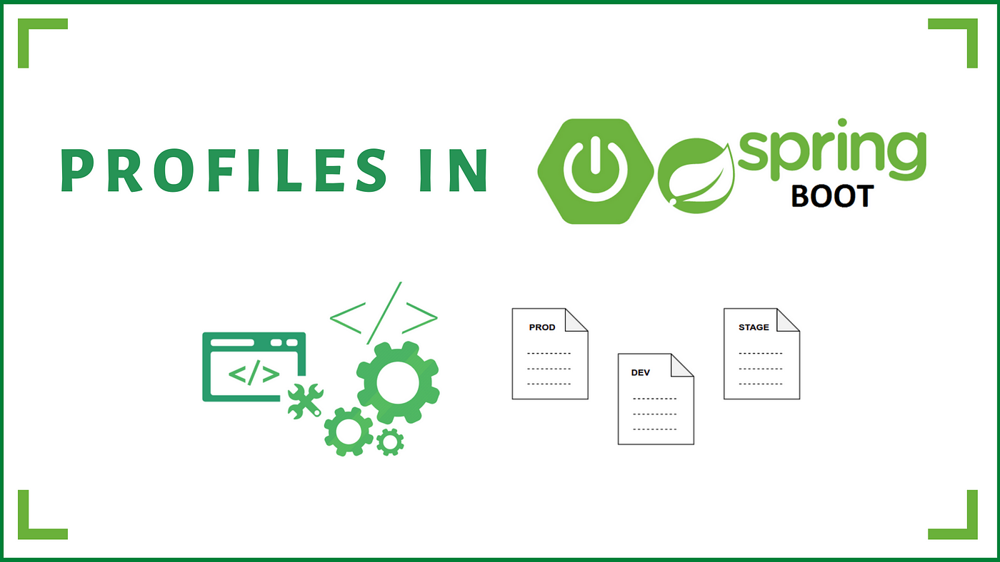

- [Perfiles de Spring Boot](#perfiles-de-spring-boot)
- [Práctica de clase: Perfiles y configuración de entorno](#práctica-de-clase-perfiles-y-configuración-de-entorno)



# Perfiles de Spring Boot
Podemos definir perfiles de Spring Boot para que se ejecuten en función del entorno en el que se encuentre la aplicación. Por ejemplo, podemos tener un perfil para desarrollo y otro para producción. Para ello, debemos crear un fichero de propiedades para cada perfil, con el nombre `application-{nombre_perfil}.properties`. Por ejemplo, si tenemos un perfil de desarrollo, el fichero se llamará `application-dev.properties`. En este fichero, podemos definir las propiedades que queramos, que sobreescribirán a las definidas en el fichero `application.properties`. Para activar un perfil, debemos añadir la propiedad `spring.profiles.active={nombre_perfil}` en el fichero `application.properties`. Si no se define esta propiedad, se ejecutará el perfil por defecto, que es el que no tiene nombre.

De esta manera podemos tener distintos perfiles para distintos entornos, y que se ejecuten en función de la propiedad `spring.profiles.active`.

Por ejemplo, si tenemos el siguiente fichero `application.properties`:

```properties
# PERFIL GLOBAL
## Puerto de la aplicaci�n
# (si has activado https, es por defecto el del SSL)
# Tomamos el puerto de la variable de entorno PORT
server.port=${PORT:6983}
## INDICAMOS EL PERFIL ACTIVO
#Indicamos el perfil por defecto (Base de datos y otros)
# dev: developmet. application-dev.properties
# prod: production. application-prod.properties
spring.profiles.active=dev
```
Y el siguiente fichero `application-dev.properties`:

```properties
# PERFIL DE DESARROLLO
# Por ejemplo vamos a meter la base de datos
## Base de datos de desarrollo
# En fichero embebida o en memoria, t� eliges
# spring.datasource.url=jdbc:h2:./productosapirest
spring.datasource.url=jdbc:h2:mem:raquetas
# Usuario y contrase�a de la base de datos
spring.datasource.username=sa
#spring.datasource.password=password
# Habilitamos la consola de H2
http=//localhost:{server.port}/h2-console
# En nuestro caso http://localhost:69680/h2-console
spring.h2.console.enabled=true
# Habilitamos los mensajes sql en el log para ver las consultas
spring.jpa.show-sql=true
# Habilitamos que cargue los datos de prueba en la base de datos
# estos datos los carga del fichero data.sql del directorio resources
spring.jpa.defer-datasource-initialization=true
spring.jpa.hibernate.ddl-auto=create-drop
spring.sql.init.mode=always
spring.jpa.database-platform=org.hibernate.dialect.H2Dialect
```

Y tener el siguiente fichero `application-prod.properties`:

```properties
# PERFIL DE PRODUCCION
# Por ejemplo vamos a meter la base de datos
spring.datasource.url=jdbc:mysql://localhost:3306/raquetas
spring.datasource.username=root
spring.datasource.password=password
# Driver y opciones
spring.jpa.properties.hibernate.dialect=org.hibernate.dialect.MySQL5Dialect
spring.jpa.hibernate.ddl-auto=update
```

Podemos cambiar el perfil llamando a la aplicación con el parámetro `--spring.profiles.active={nombre_perfil}`. Por ejemplo, si queremos ejecutar el perfil de producción, ejecutaremos la aplicación de la siguiente manera:

```bash
java -jar productosapirest-0.0.1-SNAPSHOT.jar --spring.profiles.active=prod
```

# Práctica de clase: Perfiles y configuración de entorno
1. Configura los perfiles de desarrollo y producción de tu servicio
2. Configura Swagger para que se ejecute en el perfil de desarrollo
