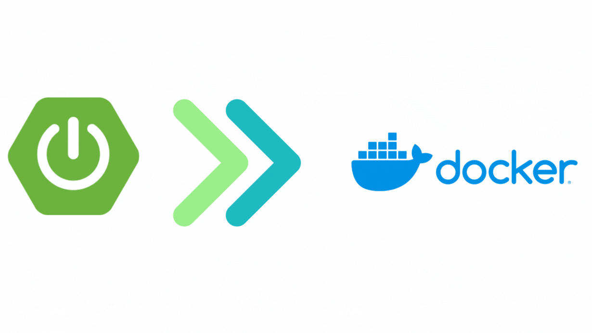

- [Desplegando nuestra aplicación](#desplegando-nuestra-aplicación)
  - [Ajustando perfiles de test](#ajustando-perfiles-de-test)
  - [Creando un JAR](#creando-un-jar)
  - [Despliegue de aplicación JVM](#despliegue-de-aplicación-jvm)
  - [Compilando y Desplegar usando Docker](#compilando-y-desplegar-usando-docker)
- [Práctica de clase: Despliegue](#práctica-de-clase-despliegue)
- [Proyecto del curso](#proyecto-del-curso)



# Desplegando nuestra aplicación

## Ajustando perfiles de test
Podemos ajustar los perfiles que usará nuestra aplicación por defecto para test, si no le pasamos nada. En Gradle, en el fichero build.gradle.kts

```kotlin
tasks.test {
    // Ponemos el perfil de test para que cargue el application-test.properties
    // para ahorranos hacer esto
    //./gradlew test -Pspring.profiles.active=dev
    systemProperty("spring.profiles.active", project.findProperty("spring.profiles.active") ?: "dev")
}
```

## Creando un JAR
Para crear un JAR de nuestra aplicación, debemos ejecutar el comando de Maven:

```bash
./gradlew build
```

Te recuerdo que estos comandos los puedes ejecutar desde el propio IDE, en la pestaña de Gradle

Puedes evitar los test con -x test, pero como hemos trabajado con H2, no hay problema

```bash
./gradlew build -x test
```

Si lo que queremos es pasar los test en un perfil de Spring, podemos hacerlo de la siguiente manera:

```bash
./gradlew test -Pspring.profiles.active=dev
```

Ejecutamos el JAR que se encuetra en el directorio build/libs

```bash
java -jar productosapirest-0.0.1-SNAPSHOT.jar
```

Si queremos ejecutar el JAR con un perfil de Spring, podemos hacerlo de la siguiente manera:

```bash
java -jar -Dspring.profiles.active=dev productosapirest-0.0.1-SNAPSHOT.jar
```

## Despliegue de aplicación JVM
Para desplegar una aplicación Java en un contenedor Docker, necesitarás un Dockerfile que defina cómo se va a construir tu contenedor y tu fichero jar.

```Dockerfile
# Usa una imagen base de Java 11 (puedes cambiar a la versión que necesites)
FROM openjdk:17-jdk

# Copia el archivo .jar de tu aplicación al contenedor, cuidado donde esta por ejemplo si 
# esta en un directorio target, lo copiará al directorio raíz del contenedor (Gradle o Maven)
COPY target/mi-aplicacion.jar mi-aplicacion.jar

# Define el comando para ejecutar tu aplicación
# Para lanzarlo con un perfil distinto al fijado por defecto, se usa la instrucción
# ENTRYPOINT ["java","-jar","-Dspring.profiles.active=dev","/app/my-app.jar"]
# Para lanzarlo con un perfil distinto al fijado por defecto, se usa la instrucción
ENTRYPOINT ["java","-jar","/mi-aplicacion.jar"]
```

Este Dockerfile asume que tienes un archivo .jar llamado `mi-aplicacion.jar` en el directorio `target` de tu proyecto.

Para construir la imagen de Docker a partir de este Dockerfile, puedes usar el siguiente comando:

```bash
docker build -t mi-aplicacion .
```

Y para ejecutar el contenedor, puedes usar el siguiente comando, si por ejemplo usa un puerto:

```bash
docker run -p 3000:3000 mi-aplicacion
```

Este comando ejecutará tu aplicación y mapeará el puerto 3000 del contenedor al puerto 3000 de tu máquina local.

## Compilando y Desplegar usando Docker
Para compilar y construir el archivo .jar dentro del contenedor Docker, puedes usar un enfoque de múltiples etapas en tu Dockerfile. Aquí hay un ejemplo de cómo hacerlo:

```Dockerfile
# Etapa de compilación, un docker especifico, que se etiqueta como build
FROM gradle:jdk17-alpine AS build

# Directorio de trabajo
WORKDIR /app

# Copia los archivos build.gradle y src de nuestro proyecto
COPY build.gradle.kts .
COPY gradlew .
COPY gradle gradle
COPY src src

# Compila y construye el proyecto, podemos evitar los test evitando con -x test
# Para fijar un perfil de compilación, se usa la instrucción
# RUN ./gradlew build -Dspring.profiles.active=dev
RUN ./gradlew build

# Etapa de ejecución, un docker especifico, que se etiqueta como run
# Con una imagen de java, solo neceistamos el jre
# FROM openjdk:17-jdk AS run
FROM eclipse-temurin:17-jre-alpine AS run

# Directorio de trabajo
WORKDIR /app

# Copia el jar de la aplicación, ojo que esta en la etapa de compilación, etiquetado como build
# Cuidado con la ruta definida cuando has copiado las cosas en la etapa de compilación
# Para copiar un archivo de una etapa a otra, se usa la instrucción COPY --from=etapaOrigen
COPY --from=build /app/build/libs/*SNAPSHOT.jar /app/my-app.jar

# Expone el puerto 3000
EXPOSE 3000

# Ejecuta el jar
# Para lanzarlo con un perfil distinto al fijado por defecto, se usa la instrucción
# ENTRYPOINT ["java","-jar","-Dspring.profiles.active=dev","/app/my-app.jar"]
# Para lanzarlo con un perfil distinto al fijado por defecto, se usa la instrucción
ENTRYPOINT ["java","-jar","/app/my-app.jar"]
```

**OJO** Ten en cuenta los perfiles activos, si no se lo indicas, por defecto se ejecutará el perfil por defecto fijado en application.properties

Este Dockerfile utiliza una imagen base de Maven para compilar y construir tu aplicación, y luego copia el archivo .jar resultante a una nueva imagen basada en OpenJDK.

Para ejecutar esta imagen hacemos lo siguiente:

```bash
# crear la imagen desde el dockerfile y la ejecuta. Abre los puertos si los necesitas
docker build -t my-app .
docker run -p 3000:3000 my-app
```

A continuación, puedes utilizar Docker Compose para gestionar tu aplicación. Aquí tienes un ejemplo básico de un archivo `docker-compose.yml`:

```yaml
version: '3.8'
services:
  mi-aplicacion:
    build:
      context: .
      dockerfile: Dockerfile
    ports:
      - "8080:8080"
    restart: always
    env_file: .env
```

Este archivo Docker Compose construirá y ejecutará tu aplicación utilizando el Dockerfile en el directorio actual, y mapeará el puerto 8080 (si no lo necesites quítalo) del contenedor al puerto 3000 de tu máquina local.

Para construir y ejecutar tu aplicación con Docker Compose, puedes usar el siguiente comando:

```bash
docker-compose up --build
```

Este comando construirá la imagen de tu aplicación (si no se ha construido ya) y luego ejecutará el contenedor.

Puedes consultar otras formas [aquí](https://spring.io/guides/topicals/spring-boot-docker/).

# Práctica de clase: Despliegue
1. Despliega completamente tu servicio usando docker, incluyendo las bases de datos necesarias para su funcionamiento. Ten en cuenta los perfiles dev y prod, para que puedas crear la imagen con uno y ejecutarla con otro.

# Proyecto del curso
Puedes encontrar el proyecto con lo visto hasta este punto en la etiqueta: [v.0.0.10 del repositorio del curso: perfiles_despliegue](https://github.com/joseluisgs/DesarrolloWebEntornosServidor-02-Proyecto-2023-2024/releases/tag/perfiles_despliegue).

